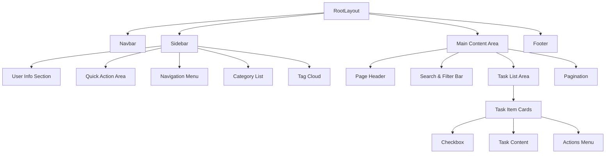

# ToDoList Web 应用前端开发计划

## 1. 项目概述

基于已有的 SeeyGo Next.js 项目，开发一个功能完整的 ToDoList Web 应用。项目将充分利用现有的技术栈（Next.js 15.5.2 + React 19 + TypeScript + Tailwind CSS），在当前基础架构上扩展待办事项管理功能。

### 核心功能目标
- 待办事项的增删改查
- 任务分类与标签管理
- 优先级设置与状态跟踪
- 响应式界面设计
- 数据持久化存储

## 2. 技术栈确认

### 前端技术栈
- **框架**: Next.js 15.5.2 (App Router)
- **UI 库**: React 19.1.0
- **类型系统**: TypeScript ^5
- **样式方案**: Tailwind CSS ^4
- **代码质量**: Biome 2.2.0
- **字体优化**: next/font (Geist 字体)
- **状态管理**: React Hooks + Context API
- **数据存储**: localStorage + IndexedDB

### 开发工具
- **包管理器**: pnpm
- **构建工具**: Turbopack (开发环境)
- **代码格式化**: Biome

## 3. 组件架构设计

### 整体布局结构

基于现有的 RootLayout 架构，扩展 ToDoList 功能：



### 核心组件层次

#### 布局组件层
- **RootLayout**: 全局布局容器（已存在，需扩展）
- **Sidebar**: 侧边导航栏（已存在，需重构）
- **Navbar**: 顶部导航（已存在，需适配）
- **MainContent**: 主内容区域

#### 功能组件层
- **TaskList**: 任务列表容器
- **TaskItem**: 单个任务卡片
- **TaskForm**: 任务创建/编辑表单
- **CategoryManager**: 分类管理器
- **TagManager**: 标签管理器
- **FilterPanel**: 过滤器面板

#### UI 组件层
- **Modal**: 通用模态框
- **Button**: 自定义按钮组件
- **Input**: 表单输入组件
- **Dropdown**: 下拉选择器
- **DatePicker**: 日期选择器

## 4. 页面结构设计

### 主要页面路由

```
/                    - 首页（所有任务）
/today              - 今日任务
/important          - 重要任务
/completed          - 已完成任务
/category/[id]      - 分类任务页
/settings           - 设置页面
```

### 页面组件设计

#### 4.1 任务列表页面 (TaskListPage)
```typescript
interface TaskListPageProps {
  filter: 'all' | 'today' | 'important' | 'completed'
  categoryId?: string
}
```

**组件结构:**
- 页面标题与操作栏
- 搜索与过滤栏
- 任务列表区域
- 分页/无限滚动

#### 4.2 任务表单模态框 (TaskFormModal)
```typescript
interface TaskFormProps {
  mode: 'create' | 'edit'
  taskId?: string
  onSave: (task: Task) => void
  onCancel: () => void
}
```

**表单字段:**
- 任务标题 (必填)
- 任务描述
- 优先级选择
- 截止日期
- 分类选择
- 标签输入

## 5. 数据模型设计

### 核心数据类型

```typescript
interface Task {
  id: string
  title: string
  description?: string
  completed: boolean
  priority: 'low' | 'medium' | 'high'
  dueDate?: Date
  createdAt: Date
  updatedAt: Date
  categoryId?: string
  tags: string[]
}

interface Category {
  id: string
  name: string
  color: string
  taskCount: number
}

interface Tag {
  id: string
  name: string
  usageCount: number
}
```

### 状态管理设计

```typescript
interface AppState {
  tasks: Task[]
  categories: Category[]
  tags: Tag[]
  filters: {
    search: string
    priority: Priority | null
    category: string | null
    tags: string[]
    dateRange: [Date?, Date?]
  }
  ui: {
    currentView: ViewType
    sortBy: SortType
    showCompleted: boolean
    sidebarCollapsed: boolean
  }
}
```

## 6. UI 设计系统

### 色彩系统（基于现有规范）
- **主色调**: #2563EB (蓝色)
- **语义色彩**:
  - 成功: #059669 (绿色)
  - 警告: #D97706 (橙色)  
  - 错误: #DC2626 (红色)
- **中性色**:
  - 深灰: #1F2937
  - 中灰: #6B7280
  - 浅灰: #F9FAFB
  - 边框: #E5E7EB

### 组件尺寸规范
- **侧边栏宽度**: 280-320px (桌面端)
- **任务卡片**: 全宽，最小高度 80px
- **模态框**: 500-600px 宽度
- **按钮高度**: 36px (默认), 32px (小), 40px (大)

### 响应式断点
- **桌面端**: ≥1200px (侧边栏固定显示)
- **平板端**: 768px-1199px (侧边栏可收缩)
- **移动端**: <768px (汉堡菜单)

## 7. 开发阶段规划

### Phase 1: 基础架构搭建 (1-2天)
1. **重构现有组件**
   - 扩展 Sidebar 组件，添加 ToDoList 导航项
   - 适配 Navbar 组件，添加任务相关搜索
   - 创建 TaskLayout 主要布局组件

2. **建立数据层**
   - 创建 Task, Category, Tag 数据模型
   - 实现 localStorage 持久化逻辑
   - 搭建 Context + useReducer 状态管理

3. **路由配置**
   - 配置任务相关页面路由
   - 实现页面间导航逻辑

### Phase 2: 核心功能开发 (3-4天)
1. **任务管理核心功能**
   - TaskList 组件 (显示任务列表)
   - TaskItem 组件 (单个任务卡片)
   - TaskForm 组件 (创建/编辑表单)
   - 任务的增删改查操作

2. **分类与标签功能**
   - Category 管理组件
   - Tag 输入与管理
   - 分类筛选逻辑

3. **搜索与过滤**
   - 实时搜索功能
   - 多维度过滤 (优先级、状态、日期)
   - 排序功能

### Phase 3: 交互优化 (1-2天)
1. **用户体验提升**
   - 拖拽排序功能
   - 快捷键支持
   - 批量操作

2. **界面细节优化**
   - 加载状态处理
   - 空状态设计
   - 错误状态处理
   - 动画过渡效果

### Phase 4: 响应式与适配 (1天)
1. **移动端适配**
   - 触摸友好的交互设计
   - 移动端布局优化
   - 手势操作支持

2. **不同屏幕尺寸测试**
   - 桌面端布局验证
   - 平板端交互测试
   - 移动端可用性验证

## 8. 文件组织结构

```
src/app/
├── components/
│   ├── layout/
│   │   ├── Sidebar.tsx (扩展现有)
│   │   ├── Navbar.tsx (适配现有)
│   │   └── MainContent.tsx
│   ├── tasks/
│   │   ├── TaskList.tsx
│   │   ├── TaskItem.tsx
│   │   ├── TaskForm.tsx
│   │   └── TaskFormModal.tsx
│   ├── categories/
│   │   ├── CategoryList.tsx
│   │   ├── CategoryForm.tsx
│   │   └── CategoryManager.tsx
│   ├── ui/
│   │   ├── Modal.tsx
│   │   ├── Button.tsx
│   │   ├── Input.tsx
│   │   ├── DatePicker.tsx
│   │   └── Dropdown.tsx
│   └── filters/
│       ├── SearchBar.tsx
│       ├── FilterPanel.tsx
│       └── SortSelector.tsx
├── hooks/
│   ├── useTasks.ts
│   ├── useCategories.ts
│   ├── useLocalStorage.ts
│   └── useFilters.ts
├── context/
│   ├── TaskContext.tsx
│   ├── CategoryContext.tsx
│   └── AppStateContext.tsx
├── types/
│   ├── task.ts
│   ├── category.ts
│   └── common.ts
├── utils/
│   ├── storage.ts
│   ├── dateUtils.ts
│   ├── taskUtils.ts
│   └── constants.ts
├── (routes)/
│   ├── page.tsx (所有任务)
│   ├── today/page.tsx
│   ├── important/page.tsx
│   ├── completed/page.tsx
│   ├── category/[id]/page.tsx
│   └── settings/page.tsx
└── globals.css (扩展现有)
```

## 9. 性能考虑

### 优化策略
1. **组件懒加载**: 使用 React.lazy 和 Suspense
2. **虚拟滚动**: 长列表性能优化
3. **防抖搜索**: 搜索输入防抖处理
4. **本地缓存**: localStorage + 内存缓存结合
5. **代码分割**: 按页面和功能模块分割

### 数据处理优化
1. **分页加载**: 任务列表分页显示
2. **索引优化**: 为搜索和过滤建立索引
3. **状态管理**: 使用 useCallback 和 useMemo 优化

## 10. 测试策略

### 单元测试
- 核心 hooks 逻辑测试
- 工具函数测试
- 组件渲染测试

### 集成测试
- 用户操作流程测试
- 数据持久化测试
- 路由导航测试

### 用户体验测试
- 响应式设计验证
- 交互友好性测试
- 性能基准测试